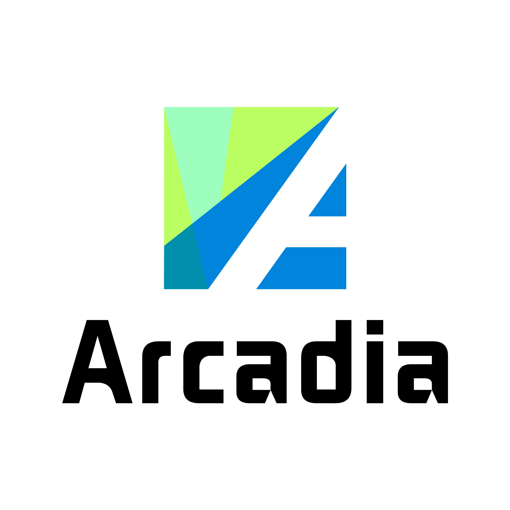

<p align="center">
    <a href="https://arcadia.cool">
        
    </a>
</p>

<p align="center">
    Arcadia 一站式代码运维平台
</p>

<p align="center">
    <strong>
        <a href="https://arcadia.cool" style="text-decoration: none;">官方网站</a>
    </strong>
</p>

## 介绍

Arcadia 源自希腊语 Αρκαδία，中文译名为 阿卡迪亚，它是希腊的一个二级行政区（州），位于伯罗奔尼撒半岛的中部山区，现被西方广泛引申为乌托邦，是传说中世界的中心位置，相当于中华文化中的世外桃源。

Arcadia 平台目前主要面向于脚本语言编程，适用于中小型团队与个人的开发与运维环境。

除了代码运维外 Arcadia 还是一个强大的定时任务运维平台，并且有着完善的文件系统和底层CLI命令设计。

## 支持的编程语言

已适配可直接运行代码文件的语言环境如下

| 类型 | 涉及文件格式 |
| :-: | :-: |
| JavaScript | `.js` `.mjs` `.cjs` |
| TypeScript | `.ts` |
| Python | `.py` |
| Go | `.go` |
| Lua | `.lua` |
| Rust | `.rs` |
| Ruby | `.rb` |
| Perl | `.pl` |
| C | `.c` |
| Shell | `.sh` |

`Node.js` `ts-node` `Deno` `Bun` `Python` `Go` `Rust` `Lua` `Ruby` `Perl` `C` `Shell`

## 安装方法

```bash
docker run -dit \
--name arcadia \
--hostname arcadia \
--network bridge \
--restart always \
-p 5678:5678 \
-v /opt/arcadia/config:/arcadia/config \
-v /opt/arcadia/log:/arcadia/log \
-v /opt/arcadia/scripts:/arcadia/scripts \
-v /opt/arcadia/repo:/arcadia/repo \
-v /opt/arcadia/raw:/arcadia/raw \
-v /opt/arcadia/tgbot:/arcadia/tgbot \
supermanito/arcadia:beta
```

之后访问 `http://localhost:5678` 进入管理面板

***

### LICENSE

Copyright © 2025, [SuperManito](https://github.com/SuperManito). Released under the [MIT](https://github.com/SuperManito/LinuxMirrors/blob/main/LICENSE).
